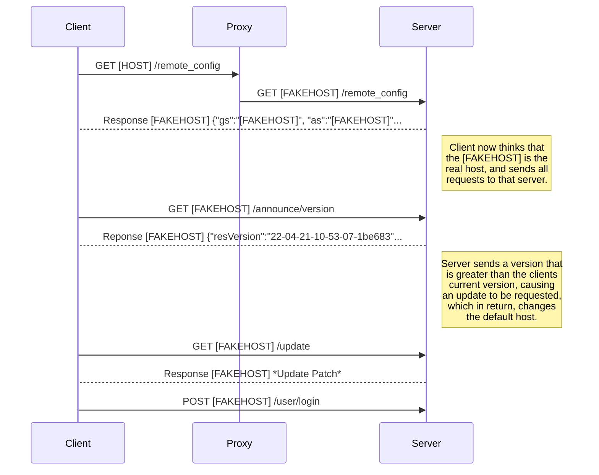
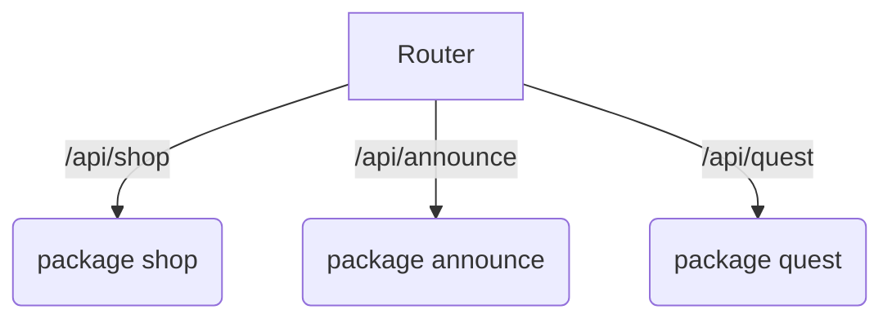

# [WIP] Doctorate

## Current Features

- [x] Announcements
- [x] Mail
- [ ] Logging in
- [ ] Missions
- [ ] Registering
- [ ] Updates
- [ ] Gacha
- [ ] Events
- [ ] Items & Rewards
- [ ] Operations / Gameplay

## Startup

### Getting Started

When starting up the server, the client only needs to connect for a couple seconds, where then it is safe to disconnect after the update has been installed. This is because the game uses a system where it only stores the remote config file. If you are running on a public Doctorate server, you will get all the updates a normal user would get, this is because Doctorate actually requests the updates from Official Servers on behalf of you and passes back adjusted data!
 


## Creating a new Router

Doctorate uses a module system to register new API routes. Each router "package" is enclosed inside the router. For example, say the game has a new path called "shop", this would be the folder name and then any routes under it are registered accordingly.


We can create a new package by simply doing something like the following:
```go
// '/router/test/test.go'
package test

// Import the router package
import (
	"github.com/Etwodev/Doctorate/server/router"
) 

func  NewRouter(status bool) router.Router {
	// Automatically creates missing tables and more for us
	router.Connector.AutoMigrate(&Test{})
	return router.NewRouter(initRoutes(), status)
}

func  initRoutes() []router.Route {
	return []router.Route{
	// path, isExperimental, isActivated, method
		router.NewGetRoute("/test/test", true, true, TestPostRoute),
	}
}
```
TestPostRoute may look something like this:
```go
// '/router/test/test_routes.go
package test

import (
	"net/http"
	"github.com/Etwodev/Doctorate/server/httputils"
	"github.com/Etwodev/Doctorate/server/router"
)

func  TestPostRoute(w http.ResponseWriter, r *http.Request) {
	var t Test
	// Gets all data relating to the object Test 
	router.Connector.Find(&t)
	httputils.RespondWithJSON(w, http.StatusOK, pre)
}
```

We need to make sure we update our main.go file, though! 
This is to make sure the router gets initialised and we don't get an empty router.
```go
// main.go
...
routers := []router.Router{
	// We call NewRouter(), where "true" is whether the route is should be activated
	test.NewRouter(true),
}

// Initilises all the routers
s.InitRouter(routers...)
// In this case, "true" is whether or not to run the server in experimental mode
var  r = s.InitRouters(true)
...
```

